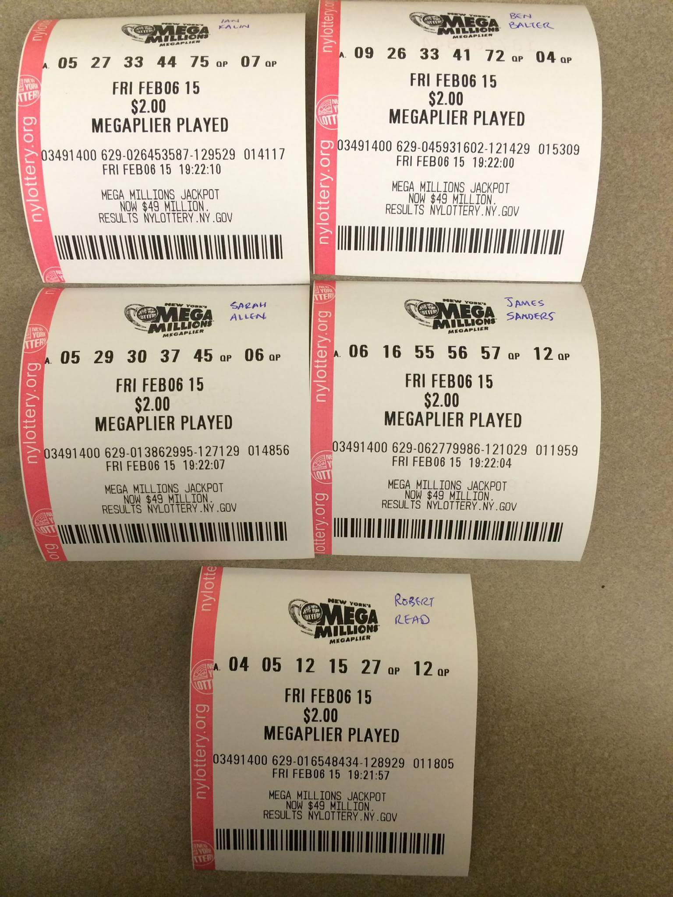

# 2018 PIF Foundation Election Candidacy Statements

## Alison Rowland

Alison is a veteran of three govtech programs. In 2013 she became a second-round PIF, subsequently co-founded 18F and later became Development Lead at the Commerce Data Service. Alison found her calling in civic tech, and as a PIFF board member, Alison hopes to help others realize the same mission, creating technology for the American people. As a board member, Alison's goals would include: achieving continuity of programs, such as the alumni weekend, as long-standing Board members complete their terms; help recruit a diverse slate of Fellows and welcome them to the community, especially through the PIF onboarding experience; and continue to develop the Speakers' Bureau, as it is so important to foster the spread of great ideas and innovation, get word out about the program, and to provide ongoing opportunities for alumni. In addition, Alison would like to propose a "phone-a-friend" program, for current PIFs to get advice from alumni who are amongst the few people who've been in their shoes. Alison's strengths are in listening, achieving consensus, being a force multiplier, and a strong commitment to diversity and inclusion. She would bring all of these, along with her deep history in govtech, to the PIFF board.

## Henry Wei 

Hello. I'm Henry, the doctor from Round 1.  Please do *not* vote for me.  I just wanted to say hi to everyone and exploit this process to share a quirky story from the inception of the Foundation.  I am likely to share this repeatedly every couple of years.

Back then, I was on the provisional Board, and we were figuring out how to randomly and fairly decide who would get the 1-year vs 2-year seats to begin the offset Board terms.  We didn’t want everyone being re-elected all at once, and I’m sure there’s some good justification for that somewhere.

At 7:10pm ET the night we were to decide, I wrote to Adam Riggs (R2) and Raph Majma (R1):  "Okay I'm going to head to the grocery store and buy five mega millions lottery tickets randomly generated, then I'll write the new board members names on each new one, one for each member. I'll photo this and send to you both. The two with the numbers closest to the winning lotto numbers tonight (highest number of exact matches but then if tie etc closest on the bonus ball to the actual winning bonus number) get the 2-year terms."  

So I drive to the Stop & Shop and, despite a broken machine, find someone to sell me the lottery tickets. 

Midnight rolls through and, dang it, some people have tied!  ...and the tie breaker doesn't work either since *two* people got the same bonus ball!  What are the chances?  (Actually they were non-zero.)

I pen an extensive email to Raph and Adam and make sure the time stamp is clear also.   I'm going to fall back to the Oregon Pick 4 game, which completes later, and use that to break the tie based on the first number and non-overlapping ranges.  See, this way we have time-stamped external random-number-generator verifiability, something we could have solved with technology, but why do that when you can overly
complicate the procedure with naturally occurring state lottery results?

At 1 a.m., Adam Riggs emails me back: "Good Lord."

Later at 5:33 am I wake up and check the results and we have our first PIF Foundation Board seats assigned and offset properly so that not every seat is turning over at the same time.  

In the photo below you’ll see the original five: Ian, Ben, Sarah, James and Robert, and the lotto tickets and the subsequent state lotto tickets decided who got the longer terms and who got the shorter terms.

